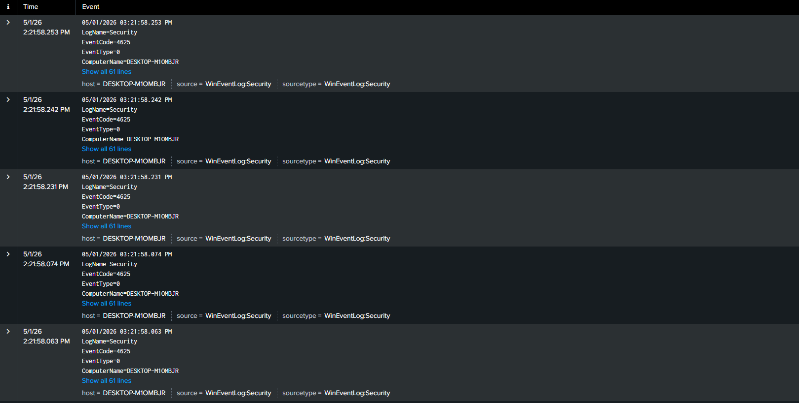

# SOC Analyst Simulation: Brute Force Detection using Splunk

## 📌 Overview

This project simulates a real-world SOC investigation where a brute-force attack is detected, analysed, and attributed using Splunk SIEM.

The lab demonstrates end-to-end workflow: log ingestion → detection → investigation → response.

---

## 🧭 Investigation Process

1. Identified abnormal authentication activity using Event ID 4625  
2. Filtered logs to isolate failed login attempts  
3. Analysed key fields:
   - Account_Name  
   - Source_Network_Address  
4. Correlated repeated login attempts over time  
5. Identified attacker IP (192.168.56.30)  
6. Confirmed brute-force behaviour based on frequency and pattern

---

## 🧠 Skills Demonstrated

- SIEM log analysis using Splunk (SPL queries, event filtering)
- Detection of brute-force attacks via Event ID 4625
- Log correlation across time and source IP
- Incident investigation and attacker attribution
- Analysis of Windows Security Event Logs

---

## 🧱 Lab Environment

The environment consisted of three virtual machines:

* **Attacker:** Kali Linux (192.168.56.30)
* **Target:** Windows 10 (192.168.56.20)
* **SIEM:** Splunk Enterprise (192.168.56.10)

All systems were configured within an isolated virtual network.

---

## 🎯 MITRE ATT&CK Mapping

- Technique: T1110 – Brute Force  
- Sub-technique: Password Guessing  
- Data Source: Windows Security Event Logs (Event ID 4625)

---

## ⚔️ Attack Simulation

A brute-force attack was simulated using Hydra against the Windows target over SMB.

Multiple failed authentication attempts were generated using a password list targeting the `testuser` account.

---

## 🔍 Detection & Analysis

### Failed Login Activity

Multiple failed login attempts were detected using Windows Security Event ID **4625**.

These events occurred within a short time frame, indicating abnormal authentication behaviour.

---

### Attacker Identification

Analysis of failed login events revealed that the activity originated from a single source IP address:

**192.168.56.30 (Kali Linux attacker machine)**

---

### Brute Force Detection

Aggregated log analysis over time showed repeated login attempts against the same account within short intervals.

This pattern is consistent with brute-force attack behaviour.

---

## 📊 Key Splunk Queries

### Detect Failed Logins

```spl
index=* EventCode=4625
| sort - _time
```

### Identify Attacker IP

```spl
index=* EventCode=4625
| stats count by Source_Network_Address
| sort - count
```

### Detect Brute Force Pattern

```spl
index=* EventCode=4625
| bucket _time span=1m
| stats count by _time, Account_Name, Source_Network_Address
| where count >= 3
```

---

## 📸 Screenshots

### Lab Environment


### Failed Login Pattern


Multiple Event ID 4625 entries were observed within a short time window, indicating repeated failed authentication attempts consistent with brute-force activity.

### Attacker Identification


The majority of failed login attempts originated from a single source IP (192.168.56.30), identifying the attacker system within the lab.

### Brute Force Detection


Aggregated log analysis over time revealed a high frequency of login attempts against the same account, confirming brute-force attack behaviour.

---

## 🔎 Detection Logic

The brute-force attack was identified using the following indicators:

- High volume of Event ID 4625 (failed logins)
- Repeated attempts against the same account
- Single source IP generating multiple failures
- Short time intervals between attempts

These indicators were correlated using Splunk SPL queries to confirm malicious behaviour.

---

## 🛡️ Impact

If successful, the attack could result in unauthorised access to the system, potentially enabling privilege escalation or lateral movement within the network.

This type of activity is commonly associated with credential-based attacks in enterprise environments.

---

## ✅ Recommended Mitigations

* Implement account lockout policies
* Monitor repeated authentication failures
* Block suspicious IP addresses
* Enable multi-factor authentication (MFA)
* Configure SIEM alerting for abnormal login activity

---

## 🧠 Key Learning

This project demonstrates the ability to:

* Analyse Windows security logs
* Detect brute-force attack patterns
* Identify attacker sources using log correlation
* Use Splunk SIEM for security monitoring and investigation

---

## 📌 Summary

This project demonstrates the ability to simulate, detect, and analyse a brute-force attack using SIEM tools in a controlled lab environment, following a structured SOC investigation workflow.

---
