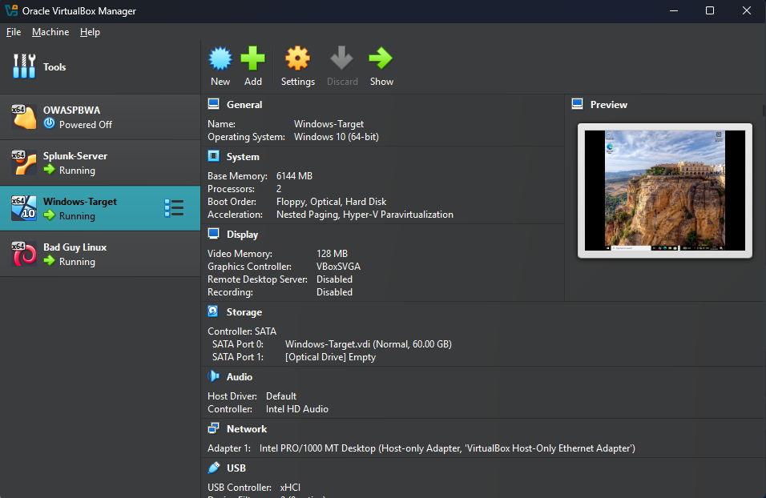
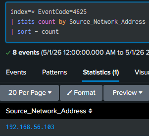
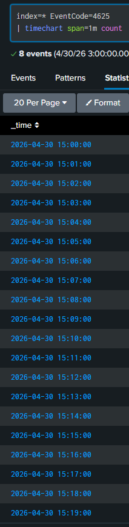

# SOC Analyst Simulation: Brute Force Detection using Splunk

## 📌 Overview

This project demonstrates a simulated Security Operations Center (SOC) investigation.
A brute-force attack was launched from a Kali Linux machine against a Windows target, with logs forwarded to Splunk for detection and analysis.

The objective was to identify malicious authentication activity and analyse attack patterns using SIEM tools.

---

## 🧠 Skills Demonstrated

- SIEM log analysis (Splunk)
- Threat detection and pattern recognition
- Incident investigation and analysis
- Windows Event Log analysis (Event ID 4625)
- Network-based attack simulation

---

## 🧱 Lab Environment

The environment consisted of three virtual machines:

* **Attacker:** Kali Linux (192.168.56.30)
* **Target:** Windows 10 (192.168.56.20)
* **SIEM:** Splunk Enterprise (192.168.56.10)

All systems were configured within an isolated virtual network.

---

## ⚔️ Attack Simulation

A brute-force attack was simulated using Hydra against the Windows target over SMB.

Multiple failed authentication attempts were generated using a password list targeting the `testuser` account.

---

## 🔍 Detection & Analysis

### Failed Login Activity

Multiple failed login attempts were detected using Windows Security Event ID **4625**.

These events occurred within a short time frame, indicating abnormal authentication behaviour.

---

### Attacker Identification

Analysis of failed login events revealed that the activity originated from a single source IP address:

**192.168.56.30 (Kali Linux attacker machine)**

---

### Brute Force Detection

Aggregated log analysis over time showed repeated login attempts against the same account within short intervals.

This pattern is consistent with brute-force attack behaviour.

---

## 📊 Key Splunk Queries

### Detect Failed Logins

```spl
index=* EventCode=4625
| sort - _time
```

### Identify Attacker IP

```spl
index=* EventCode=4625
| stats count by Source_Network_Address
| sort - count
```

### Detect Brute Force Pattern

```spl
index=* EventCode=4625
| bucket _time span=1m
| stats count by _time, Account_Name, Source_Network_Address
| where count >= 3
```

---

## 📸 Screenshots

### Lab Environment


### Failed Login Pattern


Multiple failed authentication attempts (Event ID 4625) were observed within a short time period, indicating abnormal login behaviour.

### Attacker Identification


Analysis revealed that the failed login attempts originated from a single source IP address, identifying the attacker system.

### Brute Force Detection


Aggregated log analysis confirmed repeated login attempts against the same account, consistent with brute-force attack behaviour.

---

## 🛡️ Impact

If successful, the attacker could gain unauthorised access to the system, potentially leading to privilege escalation or lateral movement within the network.

---

## ✅ Recommended Mitigations

* Implement account lockout policies
* Monitor repeated authentication failures
* Block suspicious IP addresses
* Enable multi-factor authentication (MFA)
* Configure SIEM alerting for abnormal login activity

---

## 🧠 Key Learning

This project demonstrates the ability to:

* Analyse Windows security logs
* Detect brute-force attack patterns
* Identify attacker sources using log correlation
* Use Splunk SIEM for security monitoring and investigation

---
